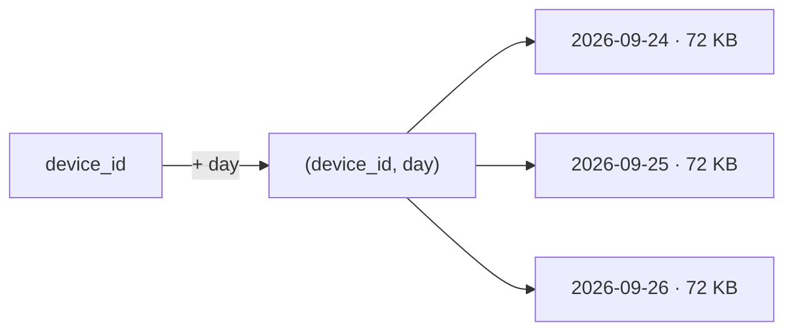

# BP 3 — Bounded Partitions (Bucketing)

[⬅ Back to README](../../README.md)

## Problem Summary

Every partition key must have a **natural upper bound** on size. Add a time or hash bucket so no partition grows past ~100 MB.

## Mermaid Diagram



## Concrete Example

```sql
-- ✅ bounded: one partition per device per day
PRIMARY KEY ((device_id, day), ts)

-- read a week = 7 small partition reads in parallel
```

```csharp
var days = Enumerable.Range(0, 7).Select(i => IotRepository.DayOf(DateTimeOffset.UtcNow.AddDays(-i)));
var results = await Task.WhenAll(days.Select(d => session.ExecuteAsync(select.Bind("device-17", d))));
```

| Check | Tool | Target |
|---|---|---|
| Max partition size | `nodetool tablehistograms` (Partition Size, Max) | < 100 MB |
| Large partition warnings | `system.log` "Writing large partition" | none |

→ Sizing math: [06-modeling/03-partition-sizing.md](../06-modeling/03-partition-sizing.md)

## Reference

- [Data Modeling: Refining](https://cassandra.apache.org/doc/latest/cassandra/developing/data-modeling/data-modeling_refining.html)

---

[⬅ Back to README](../../README.md)
