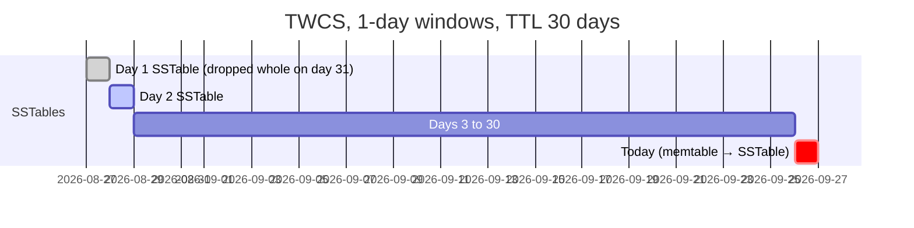

# BP 4 — Expire Time-Series with TTL + TWCS

[⬅ Back to README](../../README.md)

## Problem Summary

For retention, don't run `DELETE` jobs. Set `default_time_to_live` and use **TWCS**: each time window becomes one SSTable, and when all its data expires the whole file is dropped — no tombstone scans.

## Mermaid Diagram



## Concrete Example

```sql
ALTER TABLE iot.readings_by_device_day WITH
  default_time_to_live = 2592000   -- 30 days
  AND compaction = {'class': 'TimeWindowCompactionStrategy',
                    'compaction_window_unit': 'DAYS',
                    'compaction_window_size': 1};
```

| Retention approach | Tombstones | Disk I/O |
|---|---:|---|
| Nightly `DELETE WHERE day < ?` job | millions | reads + compaction churn |
| **TTL + TWCS** | expire in place | drop whole SSTable files |

⚠️ Keep writes in time order and avoid mixing TTL / non-TTL data in the same TWCS table.

## Reference

- [TWCS](https://cassandra.apache.org/doc/latest/cassandra/managing/operating/compaction/twcs.html)

---

[⬅ Back to README](../../README.md)
