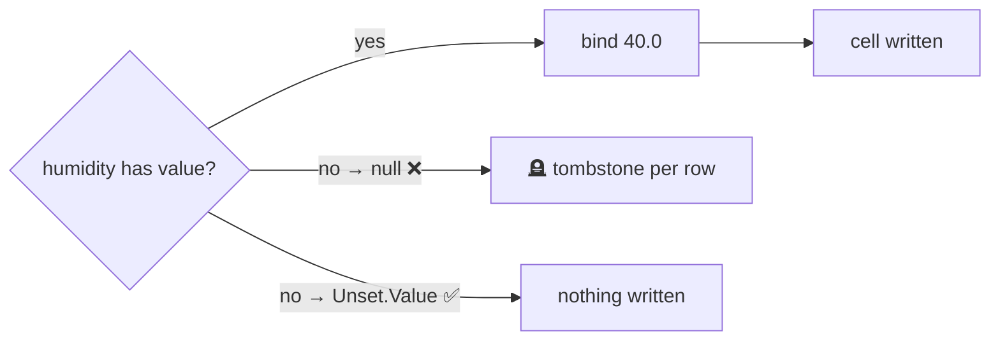

# BP 5 — Use `Unset` Instead of `null`

[⬅ Back to README](../../README.md)

## Problem Summary

Binding `null` writes a **cell tombstone**. For optional fields, bind `Unset.Value` — the column is simply not written.

## Mermaid Diagram



## Concrete Example

```csharp
// samples/CassandraDemo/IotRepository.cs
object humidityValue = humidity.HasValue ? humidity.Value : Unset.Value;
await session.ExecuteAsync(_insertReading.Bind(deviceId, day, ts, temperature, humidityValue));
```

| 1.44B rows/day, 30% missing humidity | Tombstones/day |
|---|---:|
| bind `null` | **432M** |
| bind `Unset.Value` | 0 |

## Reference

- [C# driver: Parameterized queries (unset)](https://docs.datastax.com/en/developer/csharp-driver/latest/features/parametrized-queries/index.html)

---

[⬅ Back to README](../../README.md)
