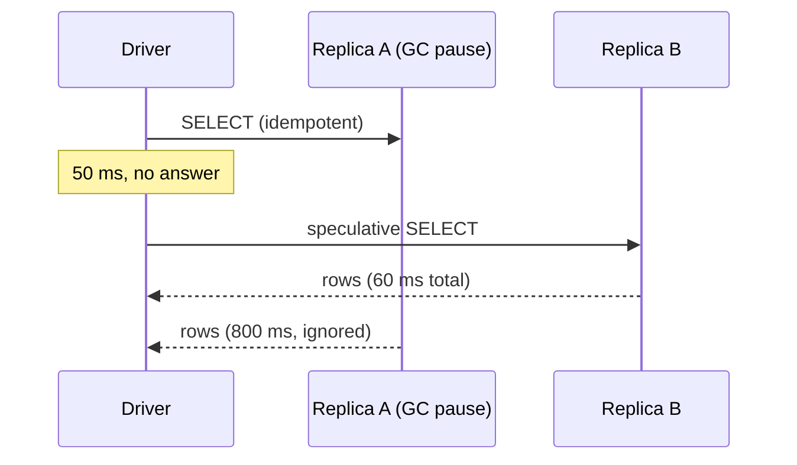

# BP 6 — Idempotent Statements + Speculative Execution

[⬅ Back to README](../../README.md)

## Problem Summary

The driver retries or speculates **only** on statements marked idempotent. Design writes so repeating them gives the same result, then mark them and cut p99 latency.

## Mermaid Diagram



## Concrete Example

```csharp
.WithSpeculativeExecutionPolicy(new ConstantSpeculativeExecutionPolicy(delay: 50, maxSpeculativeExecutions: 1))

await session.ExecuteAsync(ps.Bind(deviceId, day, ts, temp).SetIdempotence(true));   // ✅
await session.ExecuteAsync(incrementUnread.Bind(user, conv));                        // ❌ counter: leave false
```

| Pattern | Idempotent |
|---|:---:|
| `INSERT` with client-generated key (`TimeUuid.NewId()` once, reused on retry) | ✅ |
| `UPDATE SET x = ?` | ✅ |
| `x = x + 1` counter · `list + [v]` · `now()` in CQL | ❌ |

| p99 read latency (indicative) | no speculation | speculation @ 50 ms |
|---|---:|---:|
| node with GC pause | 800 ms | ~60 ms |

## Reference

- [C# driver: Speculative executions](https://docs.datastax.com/en/developer/csharp-driver/latest/features/speculative-retries/index.html)

---

[⬅ Back to README](../../README.md)
