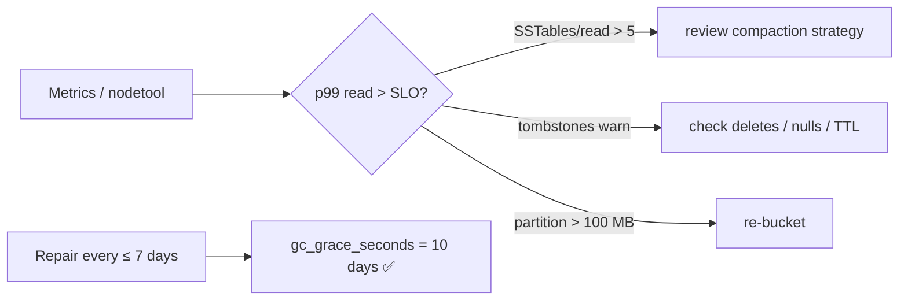

# BP 7 — Monitor Tables & Repair Within `gc_grace_seconds`

[⬅ Back to README](../../README.md)

## Problem Summary

Watch latency, SSTables per read, partition size and tombstones per table. Schedule repair more often than `gc_grace_seconds` (10 days) to prevent zombie data.

## Mermaid Diagram



## Concrete Example

```bash
nodetool tablehistograms iot readings_by_device_day   # latency, SSTables, partition size
nodetool tablestats iot.readings_by_device_day        # tombstones per slice, bloom ratio
nodetool compactionstats                              # pending compactions
nodetool repair iot                                   # incremental (4.0+)
```

| Signal | Healthy | Action threshold |
|---|---:|---:|
| SSTables per read (p99) | ≤ 3 | > 5 |
| Tombstones per slice (max) | < 100 | > 1,000 |
| Pending compactions | < 20 | growing constantly |
| Days since last repair | < 7 | ≥ 10 |

## Reference

- [Metrics](https://cassandra.apache.org/doc/latest/cassandra/managing/operating/metrics.html)
- [Repair](https://cassandra.apache.org/doc/latest/cassandra/managing/operating/repair.html)

---

[⬅ Back to README](../../README.md)
