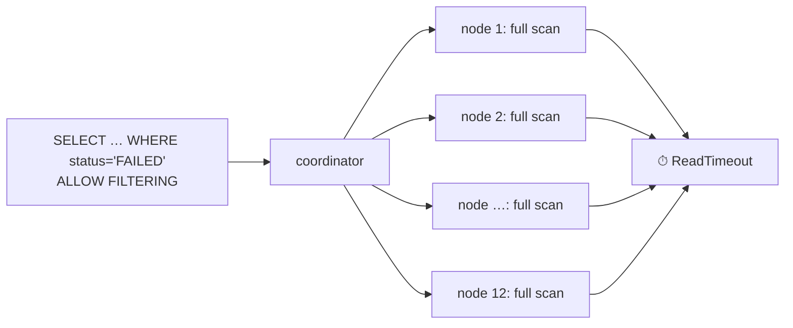

# AP 1 — `ALLOW FILTERING` / Query Without Partition Key

[⬅ Back to README](../../README.md)

## Problem Summary

Without a partition key, the coordinator must ask **every node** to scan **every SSTable**. Works in dev with 1,000 rows, times out in prod with 1B.

## Mermaid Diagram



## Concrete Example

```sql
-- ❌
SELECT * FROM shop.orders_by_customer WHERE status = 'FAILED' ALLOW FILTERING;

-- ✅ a table for this query
CREATE TABLE shop.orders_by_status_day (
  status text, day date, order_time timestamp, order_id uuid, customer_id uuid,
  PRIMARY KEY ((status, day), order_time, order_id)
) WITH CLUSTERING ORDER BY (order_time DESC, order_id ASC);

SELECT * FROM shop.orders_by_status_day WHERE status = 'FAILED' AND day = '2026-09-26';
```

| Rows in table | ❌ rows scanned | ✅ rows scanned |
|---:|---:|---:|
| 10,000 | 10,000 | ~10 |
| 1,000,000,000 | 1,000,000,000 | ~500 |

✅ `ALLOW FILTERING` is acceptable **only** when the partition key is also given (filters inside one partition).

## Reference

- [CQL DML: ALLOW FILTERING](https://cassandra.apache.org/doc/latest/cassandra/developing/cql/dml.html)

---

[⬅ Back to README](../../README.md)
