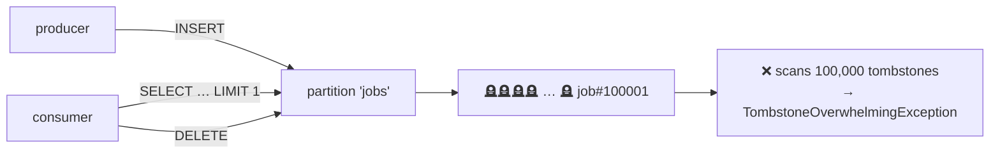

# AP 2 — Using Cassandra as a Queue

[⬅ Back to README](../../README.md)

## Problem Summary

Insert job → consumer reads oldest → deletes it. Every consumed item leaves a tombstone at the head of the partition; each poll scans all of them.

## Mermaid Diagram



## Concrete Example

```sql
-- ❌
CREATE TABLE jobs (queue text, job_id timeuuid, payload text, PRIMARY KEY (queue, job_id));
SELECT * FROM jobs WHERE queue = 'emails' LIMIT 1;   -- after 100k deletes → fails
DELETE FROM jobs WHERE queue = 'emails' AND job_id = ?;
```

| Consumed jobs (within gc_grace) | Tombstones per poll | Result |
|---:|---:|---|
| 500 | 500 | slow |
| 1,000 | 1,000 | ⚠️ WARN |
| 100,000 | 100,000 | ❌ query fails |

✅ Use Kafka / RabbitMQ / Azure Service Bus for queues. If you must: time-bucketed partitions `((queue, minute), job_id)` + TTL, never read old buckets.

## Reference

- [Compaction: Tombstones](https://cassandra.apache.org/doc/latest/cassandra/managing/operating/compaction/index.html)

---

[⬅ Back to README](../../README.md)
