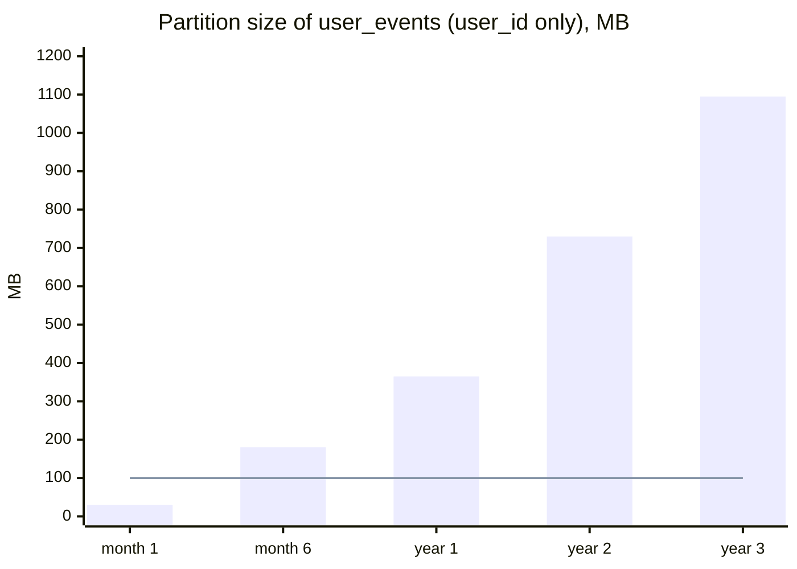

# AP 3 — Unbounded (Large) Partition

[⬅ Back to README](../../README.md)

## Problem Summary

Partition key with no natural limit (e.g. `user_id` for all events forever). Partition grows to GBs → slow reads, heap pressure during compaction, repair/streaming of huge chunks.

## Mermaid Diagram



## Concrete Example

```sql
-- ❌ ~1 MB/day for an active user → 1 GB after 3 years
CREATE TABLE app.user_events (user_id uuid, ts timeuuid, event text, PRIMARY KEY (user_id, ts));

-- ✅ bounded by month
CREATE TABLE app.user_events_by_month (
  user_id uuid, month int, ts timeuuid, event text,
  PRIMARY KEY ((user_id, month), ts)
) WITH CLUSTERING ORDER BY (ts DESC);
```

```text
# system.log symptom
WARN  Writing large partition app/user_events:5b69... (1.1 GiB) to sstable
```

## Reference

- [Data Modeling: Refining](https://cassandra.apache.org/doc/latest/cassandra/developing/data-modeling/data-modeling_refining.html)

---

[⬅ Back to README](../../README.md)
