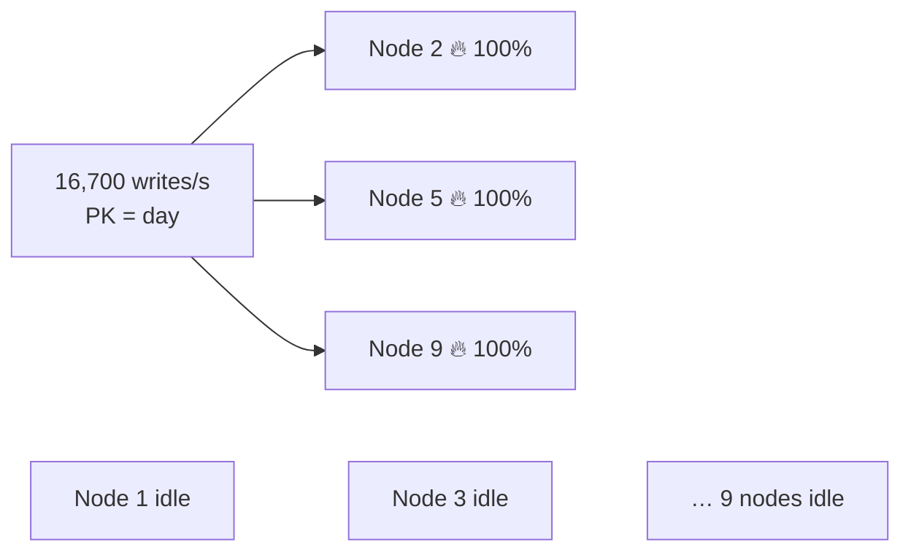

# AP 4 — Hot Partition

[⬅ Back to README](../../README.md)

## Problem Summary

Low-cardinality partition key (`day`, `status`, `country`) sends all traffic for that key to the same RF replicas — 3 nodes busy, the rest idle.

## Mermaid Diagram



## Concrete Example

```sql
-- ❌ all of today's events on 3 nodes
PRIMARY KEY (day, ts, device_id)

-- ✅ spread over 16 partitions → up to 12 nodes share the load
PRIMARY KEY ((day, bucket), ts, device_id)     -- bucket = hash(device_id) % 16
```

| Buckets | Partitions / day | Writes/s per partition (16,700 total) |
|---:|---:|---:|
| 1 | 1 | 16,700 🔥 |
| 16 | 16 | ~1,044 |
| 64 | 64 | ~261 |

Trade-off: reading one day = N parallel queries. See [IotRepository.GetAlertsAsync](../../samples/CassandraDemo/IotRepository.cs).

## Reference

- [Data Modeling: Refining](https://cassandra.apache.org/doc/latest/cassandra/developing/data-modeling/data-modeling_refining.html)

---

[⬅ Back to README](../../README.md)
