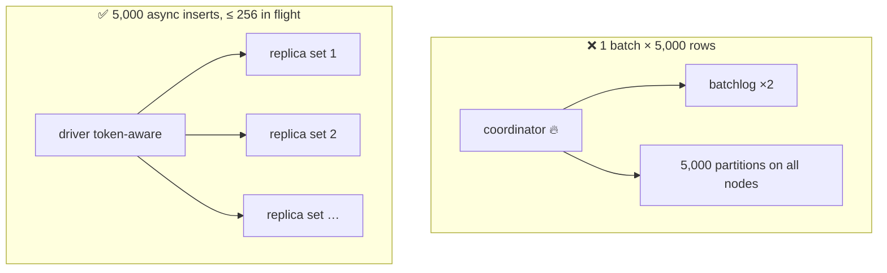

# AP 5 — Multi-Partition Batch for Bulk Loading

[⬅ Back to README](../../README.md)

## Problem Summary

A batch of thousands of rows across many partitions is **slower**, not faster: one coordinator holds it all, writes a batchlog, and fans out. Batches are for atomicity, not throughput.

## Mermaid Diagram



## Concrete Example

```csharp
// ❌
var batch = new BatchStatement();
foreach (var r in readings) batch.Add(insert.Bind(r.DeviceId, r.Day, r.Ts, r.Temperature, r.Humidity));
await session.ExecuteAsync(batch);   // "Batch ... is of size 250KiB, exceeding specified threshold of 50KiB" → fails

// ✅ bounded concurrency
using var gate = new SemaphoreSlim(256);
await Task.WhenAll(readings.Select(async r =>
{
    await gate.WaitAsync();
    try { await session.ExecuteAsync(insert.Bind(r.DeviceId, r.Day, r.Ts, r.Temperature, r.Humidity).SetIdempotence(true)); }
    finally { gate.Release(); }
}));
```

| 5,000 rows | Coordinators used | Extra writes | Outcome |
|---|---:|---:|---|
| 1 logged batch | 1 | batchlog | ❌ over 50 KiB fail threshold |
| async + token-aware | all replicas | 0 | ✅ |

## Reference

- [CQL DML: BATCH](https://cassandra.apache.org/doc/latest/cassandra/developing/cql/dml.html)

---

[⬅ Back to README](../../README.md)
