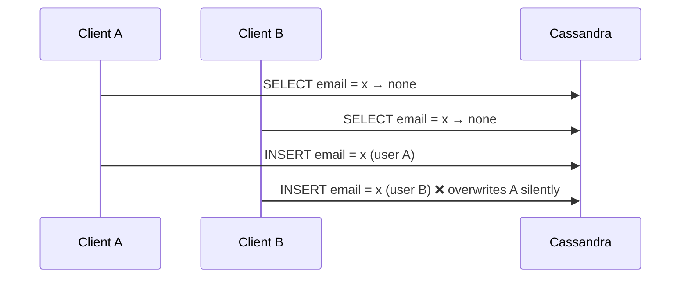

# AP 6 — Read-Before-Write & LWT Everywhere

[⬅ Back to README](../../README.md)

## Problem Summary

`SELECT` then `INSERT` to "check existence" is racy **and** doubles cost. Replacing it with LWT on every write fixes the race but costs ~4× latency and contention. Cassandra writes are upserts — design around that.

## Mermaid Diagram



## Concrete Example

```csharp
// ❌ racy + 2 round trips
var exists = (await session.ExecuteAsync(select.Bind(email))).Any();
if (!exists) await session.ExecuteAsync(insert.Bind(email, userId));

// ✅ uniqueness needed → one LWT, only here
var applied = (await session.ExecuteAsync(insertIfNotExists.Bind(email, userId))).First().GetValue<bool>("[applied]");

// ✅ uniqueness NOT needed → plain upsert (last write wins)
await session.ExecuteAsync(upsertLatest.Bind(deviceId, ts, temperature, humidity));
```

| Pattern | Round trips | Correct under concurrency |
|---|---:|:---:|
| SELECT + INSERT | 2 | ❌ |
| LWT on every write | up to 4 | ✅ but slow |
| Upsert | 1 | ✅ (LWW semantics) |
| LWT only for unique claims | 4 only on signup | ✅ |

## Reference

- [CQL DML: Conditional statements](https://cassandra.apache.org/doc/latest/cassandra/developing/cql/dml.html)

---

[⬅ Back to README](../../README.md)
