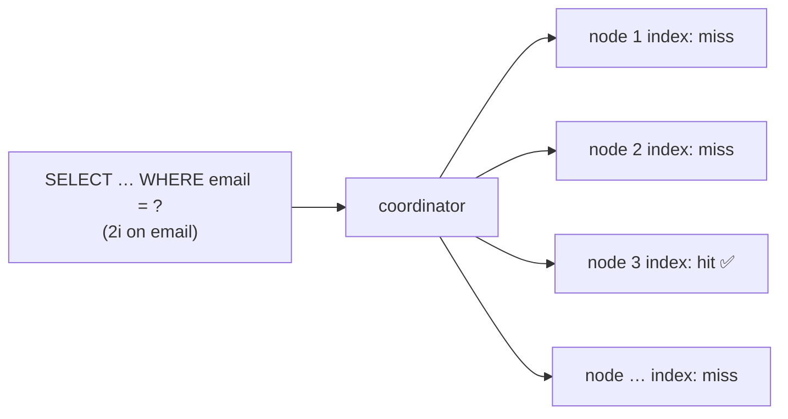

# AP 7 — Secondary Index as a Primary Access Path

[⬅ Back to README](../../README.md)

## Problem Summary

Legacy secondary indexes (2i) are **local to each node**: a query without partition key asks every node. Bad for high-cardinality columns (email) and very low ones (boolean). SAI (5.0) is better, but still fans out.

## Mermaid Diagram



## Concrete Example

```sql
-- ❌ lookup by email via index on users table: 12 nodes asked, 1 answers
CREATE INDEX ON app.users (email);
SELECT * FROM app.users WHERE email = 'sara@example.com';

-- ✅ lookup table: 1 partition
CREATE TABLE app.users_by_email (email text PRIMARY KEY, user_id uuid);

-- ✅ acceptable: SAI filter INSIDE a partition
CREATE INDEX ON iot.readings_by_device_day (temperature) USING 'sai';
SELECT * FROM iot.readings_by_device_day
WHERE device_id = 'device-17' AND day = '2026-09-26' AND temperature > 80;
```

| Index usage | Nodes queried (12-node cluster) |
|---|---:|
| lookup table | 2 (quorum) |
| SAI with partition key | 2 |
| SAI / 2i without partition key | up to 12 |

## Reference

- [SAI Overview](https://cassandra.apache.org/doc/latest/cassandra/developing/cql/indexing/sai/sai-overview.html)
- [Secondary Indexes (2i)](https://cassandra.apache.org/doc/latest/cassandra/developing/cql/indexing/2i/2i-overview.html)

---

[⬅ Back to README](../../README.md)
