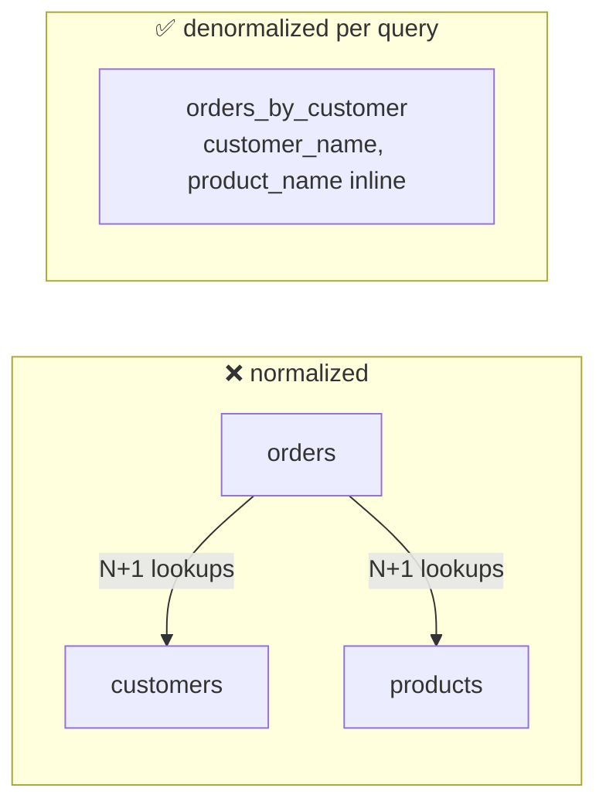

# AP 8 — Relational Thinking (Normalize + Join + COUNT)

[⬅ Back to README](../../README.md)

## Problem Summary

Normalized tables force the app to "join" with N+1 queries; `COUNT(*)` scans a whole table. In Cassandra, duplicate data per query and maintain aggregates on write.

## Mermaid Diagram



## Concrete Example

```sql
-- ❌ 1 query + 50 lookups for a page of 50 orders
SELECT * FROM shop.orders WHERE customer_id = ?;
SELECT name FROM shop.products WHERE product_id = ?;   -- ×50

-- ❌ full-cluster scan
SELECT COUNT(*) FROM shop.orders;

-- ✅ one partition read, fields copied at write time
SELECT order_id, order_date, product_name, total
FROM shop.orders_by_customer WHERE customer_id = ? LIMIT 50;

-- ✅ aggregate maintained on write
UPDATE shop.order_counts SET orders = orders + 1 WHERE customer_id = ?;
```

| Page of 50 orders | Queries | Latency (indicative) |
|---|---:|---:|
| normalized + app joins | 51 | ~50 ms |
| denormalized table | 1 | ~2 ms |

## Reference

- [Data Modeling vs RDBMS](https://cassandra.apache.org/doc/latest/cassandra/developing/data-modeling/data-modeling_rdbms.html)

---

[⬅ Back to README](../../README.md)
