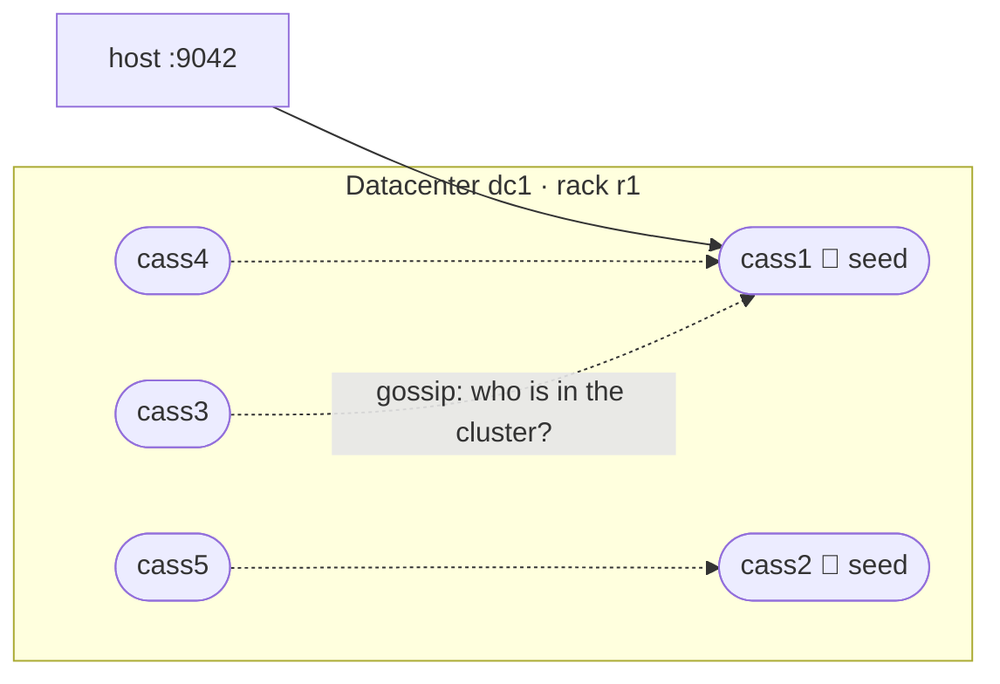

# Lab 1 — Run a 5-Node Cluster

[⬅ Back to README](../../README.md)

## Problem Summary

A single node hides replication, coordinators and failures. [`docker/cluster/compose.yml`](../../docker/cluster/compose.yml) starts 5 nodes in one datacenter (`dc1`) with `cass1` + `cass2` as seeds, so every one of those becomes observable.

## Mermaid Diagram



| Setting | Value | Why |
|---|---|---|
| `CASSANDRA_SEEDS` | `cass1,cass2` | first contact for joining nodes — not masters |
| `CASSANDRA_DC` / `RACK` | `dc1` / `r1` | read by `GossipingPropertyFileSnitch` |
| `MAX_HEAP_SIZE` | `512M` | ~1 GB RAM per node → ~5 GB total |
| `depends_on: service_healthy` | chained 1 → 5 | Cassandra rejects concurrent bootstraps |
| `ports` | `9042` on `cass1` only | single entry point from the host |

## Concrete Example

### 1 · Start

```bash
docker compose -f docker/single/compose.yml down   # free :9042 from the single-node setup
docker compose -f docker/cluster/compose.yml up -d    # ~5–8 min, nodes join one by one
docker compose -f docker/cluster/compose.yml ps       # wait for 5 × "healthy"
docker logs -f cass3                                  # "... state jump to NORMAL" = joined
```

### 2 · Check the ring

```bash
docker exec cass1 nodetool status
```

```text
Datacenter: dc1
--  Address     Load     Tokens  Owns   Host ID  Rack
UN  172.20.0.2  120 KiB  16      ?      …        r1
UN  172.20.0.3  115 KiB  16      ?      …        r1
UN  172.20.0.4  110 KiB  16      ?      …        r1
UN  172.20.0.5  108 KiB  16      ?      …        r1
UN  172.20.0.6  105 KiB  16      ?      …        r1
```

`UN` = Up + Normal · `UJ` = Up + Joining · `DN` = Down. `Owns = ?` until a keyspace defines replication.

### 3 · Replicate (RF = 3)

```sql
-- docker exec -it cass1 cqlsh
CREATE KEYSPACE demo WITH replication = {'class': 'NetworkTopologyStrategy', 'dc1': 3};
CREATE TABLE demo.users (id text PRIMARY KEY, name text);
INSERT INTO demo.users (id, name) VALUES ('u1', 'Sara');
```

```bash
docker exec cass1 nodetool getendpoints demo users u1   # → exactly 3 IPs
docker exec cass1 nodetool status demo                  # Owns (effective) ≈ 60% each (3 / 5)
```

Shortly's keyspace is created with `'dc1': 1`; raise it and copy existing rows:

```sql
ALTER KEYSPACE shortly WITH replication = {'class': 'NetworkTopologyStrategy', 'dc1': 3};
```

```bash
docker exec cass1 nodetool repair shortly
```

### 4 · Where does a new link go?

Placement follows each table's **partition key**, not the link.

| Table | Partition key | 20 links from 3 users |
|---|---|---|
| `links_by_slug` | `slug` | 20 partitions, spread over all nodes |
| `links_by_user` | `user_id` | 3 partitions — one user's links sit together |
| `link_clicks` | `slug` | created on the first `/r/{slug}` hit |

```bash
docker exec cass1 nodetool getendpoints shortly links_by_slug vnRoWmT
docker exec cass1 nodetool getendpoints shortly links_by_user 3fa85f64-5717-4562-b3fc-2c963f66afa6
```

### 5 · Kill a replica

```bash
docker exec cass1 nodetool getendpoints demo users u1   # pick one of the IPs
docker stop cass3                                       # if cass3 is one of them
```

```sql
CONSISTENCY QUORUM;  SELECT * FROM demo.users WHERE id = 'u1';   -- ✅ 2 of 3 replicas up
CONSISTENCY ALL;     SELECT * FROM demo.users WHERE id = 'u1';   -- ❌ Cannot achieve consistency level ALL
```

| CL (RF = 3) | Replicas needed | Survives |
|---|---:|---:|
| `ONE` | 1 | 2 nodes down |
| `QUORUM` | 2 | 1 node down |
| `ALL` | 3 | 0 |

```bash
docker start cass3        # back to UN in ~1 min; missed writes arrive via hinted handoff
```

### 6 · Stop

```bash
docker compose -f docker/cluster/compose.yml stop      # keep data
docker compose -f docker/cluster/compose.yml down -v   # wipe all 5 volumes
```

| Problem | Fix |
|---|---|
| `port is already allocated` | single node still running → `docker compose -f docker/single/compose.yml down` |
| node stuck in `health: starting` > 5 min | `docker logs cassN` |
| `Exited (137)` | out of RAM → raise Docker memory or run `up -d cass1 cass2 cass3` |
| driver warns it can't reach `172.20.x.x` | expected on Docker Desktop: the host only reaches `cass1`, which coordinates for the rest |

Output blocks above are illustrative; IPs and sizes differ per run.

Next → [02 · Monitor performance](02-monitor-performance.md)

## Reference

- [Docker image `cassandra` — environment variables](https://hub.docker.com/_/cassandra)
- [nodetool status](https://cassandra.apache.org/doc/latest/cassandra/managing/tools/nodetool/status.html)
- Related: [Replication](../02-architecture/09-replication.md) · [Consistency levels](../02-architecture/10-consistency-levels.md) · [Gossip](../02-architecture/07-gossip-and-failure-detection.md) · [Hinted handoff](../02-architecture/11-hinted-handoff.md)

---

[⬅ Back to README](../../README.md)
