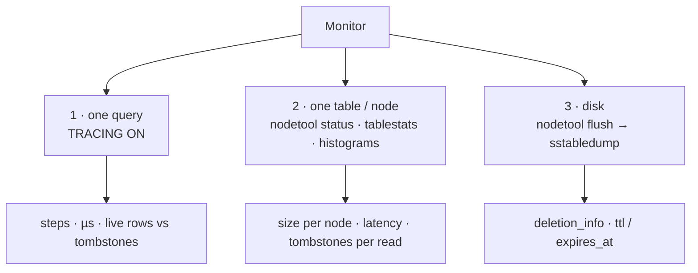

# Lab 2 — Monitor Performance

[⬅ Back to README](../../README.md)

## Problem Summary

To know what a query costs, look at three levels: one query (`TRACING ON`), one table (`nodetool`), and the files on disk (`sstabledump`). Everything below runs inside the containers — no extra tools.

## Mermaid Diagram



## Concrete Example

### 1 · One query — `TRACING ON`

```bash
docker exec -it cass1 cqlsh          # single node: docker compose exec cassandra cqlsh
```

```sql
TRACING ON;
SELECT * FROM shortly.links_by_user WHERE user_id = 3fa85f64-5717-4562-b3fc-2c963f66afa6;
```

`source_elapsed` is in **microseconds**. Measured on the single node:

| µs | Activity | Meaning |
|---:|---|---|
| 6 894 | `Parsing SELECT …` | cqlsh sends raw text → parsed every call (58% of the total) |
| 8 904 | `Executing single-partition query on links_by_user` | ✅ one partition |
| 9 571 | `Skipped 0/0 non-slice-intersecting sstables` | nothing flushed yet — data only in the memtable |
| 10 793 | `Read 0 live rows and 0 tombstone cells` | rows read vs tombstones scanned |
| 11 856 | `Request complete` | ≈ 11.9 ms |

Same table, no `WHERE` — a range scan (measured, 14.1 ms):

```text
Computing ranges to query                                         |  7064
Submitting range requests on 17 ranges with a concurrency of 1    |  7431   ← every token range
Executing seq scan across 0 sstables for (min(...), min(...)]     | 10762   ← full scan
Read 1 live rows and 0 tombstone cells                            | 13345
```

| Trace line | Verdict |
|---|---|
| `single-partition query` | ✅ |
| `range requests on N ranges` / `seq scan` | ❌ grows with table size |
| `tombstone cells` ≫ `live rows` | ❌ deletes / TTL piling up |
| `Merged data from memtables and N sstables`, N large | ⚠️ needs compaction |
| `Sending READ_REQ message to /172.20.0.x` | coordinator → replica hop (cluster only) |

Timing noise on Docker Desktop is large (one run of the same kind of scan took 59 ms): run each query ~5 times and compare the **step types**, not one number.

Past traces stay queryable:

```sql
SELECT session_id, duration, request FROM system_traces.sessions LIMIT 5;
SELECT activity, source_elapsed FROM system_traces.events WHERE session_id = <id>;
```

### 2 · Size per node and per table

Flush first — `Load` only counts SSTables on disk, not the memtable:

```bash
for n in cass1 cass2 cass3 cass4 cass5; do docker exec $n nodetool flush shortly; done
docker exec cass1 nodetool status shortly
```

```text
--  Address     Load        Tokens  Owns (effective)  Rack
UN  172.20.0.2  182.4 KiB   16      58.3%             r1
UN  172.20.0.3  175.1 KiB   16      61.2%             r1
...
```

```bash
for n in cass1 cass2 cass3 cass4 cass5; do
  echo "== $n"
  docker exec $n nodetool tablestats shortly | grep -E "Table:|Space used \(live\)|Number of partitions|tombstones per slice|read latency"
done
docker exec cass1 nodetool tablehistograms shortly links_by_user
```

| Metric | Meaning |
|---|---|
| `Load` (status) | SSTable bytes on that node, all keyspaces |
| `Owns (effective)` | share of data incl. replicas (RF 3 / 5 nodes ≈ 60%) |
| `Space used (live)` | bytes of live SSTables for the table |
| `Number of partitions (estimate)` | partitions stored on that node |
| `Average tombstones per slice` | tombstones scanned per read |
| `Local read latency` | mean local read time |
| `Partition Size` (histograms) | detects oversized partitions |

PowerShell: `foreach ($n in 'cass1','cass2','cass3','cass4','cass5') { docker exec $n nodetool flush shortly }`

### 3 · Tombstones on disk

```bash
# 1) DELETE /api/links/{slug} from Swagger, then:
docker exec cass1 nodetool flush shortly
docker exec cass1 bash -c \
  'for f in /opt/cassandra/data/data/shortly/links_by_slug-*/*-Data.db; do /opt/cassandra/tools/bin/sstabledump "$f"; done'
```

```jsonc
{ "partition": { "key": ["Iu5zq1P"],
                 "deletion_info": { "marked_deleted": "2026-09-28T09:10:00.123Z" } },  // ← DELETE tombstone
  "rows": [] }
{ "partition": { "key": ["vnRoWmT"] },
  "rows": [{ "cells": [{ "name": "url", "ttl": 604800, "expires_at": "2026-10-05T…" }] }] }  // ← TTL
```

Tombstones stay until `gc_grace_seconds` (10 days) has passed **and** compaction runs. On a cluster, run `sstabledump` on a node returned by `getendpoints`.

### 4 · Cheat sheet

| Question | Command |
|---|---|
| Is the cluster healthy? | `nodetool status` |
| Which nodes hold this key? | `nodetool getendpoints <ks> <table> <key>` |
| What did this query do? | `TRACING ON` in cqlsh |
| How big is each node / table? | `nodetool status` · `nodetool tablestats <ks>` |
| Any huge partition? | `nodetool tablehistograms <ks> <table>` |
| Where are the tombstones? | trace `tombstone cells` · `tablestats` · `sstabledump` |
| Remaining TTL? | `SELECT TTL(col) FROM …` |

Outputs marked "measured" come from this guide's single node; the others are illustrative.

Next → [03 · Load test](03-load-test.md)

## Reference

- [Tracing (cqlsh)](https://cassandra.apache.org/doc/latest/cassandra/managing/tools/cqlsh.html#tracing)
- [nodetool tablestats](https://cassandra.apache.org/doc/latest/cassandra/managing/tools/nodetool/tablestats.html)
- [sstabledump](https://cassandra.apache.org/doc/latest/cassandra/managing/tools/sstable/sstabledump.html)
- Related: [Read path](../04-read-write/02-read-path.md) · [Tombstones](../03-storage/06-tombstones.md) · [Monitor & repair](../08-best-practices/07-monitor-and-repair.md) · [ALLOW FILTERING](../09-anti-patterns/01-allow-filtering.md)

---

[⬅ Back to README](../../README.md)
