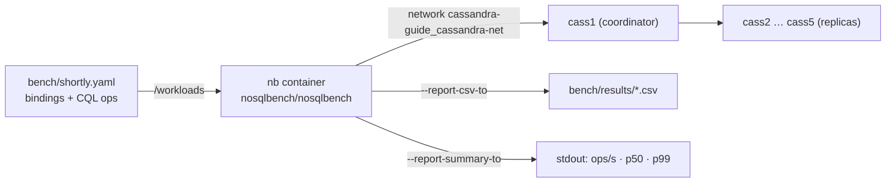
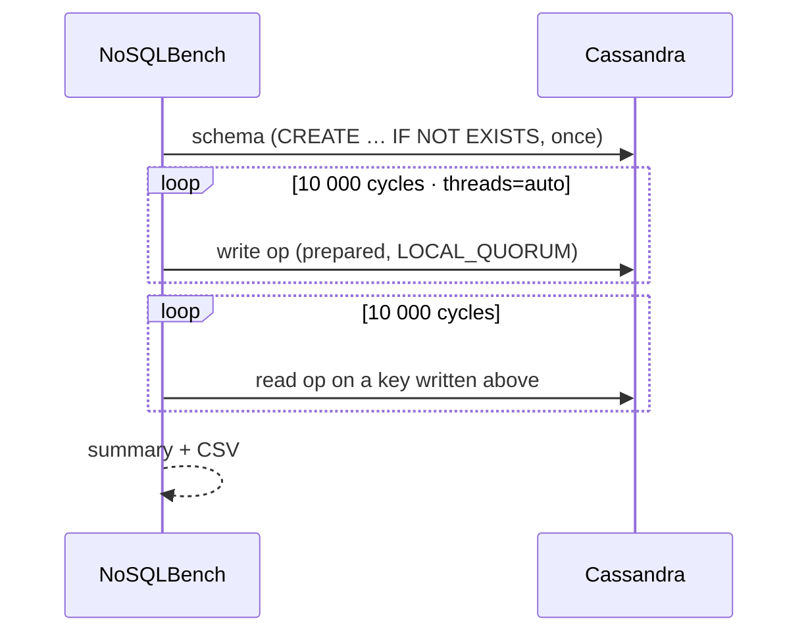

# Lab 3 — Load Test with NoSQLBench

[⬅ Back to README](../../README.md)

## Problem Summary

One trace shows the cost of one query; a load test shows throughput and tail latency under 10 000 operations. [`docker-compose.bench.yml`](../../docker-compose.bench.yml) runs NoSQLBench with the workload [`bench/shortly.yaml`](../../bench/shortly.yaml) against the Shortly tables.

## Mermaid Diagram





## Concrete Example

### 1 · Scenarios

| Scenario | Write (10k) | Read (10k) | Shows |
|---|---|---|---|
| `slug` (default) | `INSERT INTO links_by_slug … USING TTL 604800` | `SELECT url, TTL(url) … WHERE slug = ?` | single-partition reads, even spread |
| `user` | `INSERT INTO links_by_user` over **10 users** (~1 000 rows / partition) | `SELECT … WHERE user_id = ? LIMIT 20` | wide partitions on few nodes |
| `clicks` | `UPDATE link_clicks SET clicks = clicks + 1` on 100 slugs | — | counter write cost |

### 2 · Bindings — deterministic data

```yaml
slug:      Hash(); ToString() -> String                                      # cycle N → same slug every run
read_slug: Hash(); Mod(TEMPLATE(cycles,10000)); Hash(); ToString() -> String  # random index among written cycles
user_id:   Mod(10); ToHashedUUID() -> java.util.UUID                        # only 10 distinct users
```

```text
write: cycle 42 → slug = Hash(42)
read:  cycle 7  → idx = Hash(7) mod 10000 = 42 → slug = Hash(42)   ✅ hits a written row
```

### 3 · Run

```bash
docker compose -f docker-compose.cluster.yml up -d          # cluster first (Lab 01)

docker compose -f docker-compose.bench.yml run --rm nb      # scenario "slug", 10k + 10k
docker compose -f docker-compose.bench.yml run --rm nb /workloads/shortly.yaml user   host=cass1 localdc=dc1
docker compose -f docker-compose.bench.yml run --rm nb /workloads/shortly.yaml clicks host=cass1 localdc=dc1 cycles=50000
```

Single node instead of the cluster:

```bash
NB_NETWORK=cassandra-guide_default docker compose -f docker-compose.bench.yml run --rm nb \
  /workloads/shortly.yaml slug host=cassandra localdc=dc1
```

### 4 · Read the result

| Metric | Meaning | Look for |
|---|---|---|
| `cycles` / `ops` | operations done | = 10 000 |
| rate (ops/s) | throughput | write vs read vs counter |
| `p50` | typical latency | baseline |
| `p99` | 1 in 100 slowest | gap to p50 = tail problems |
| errors | failed ops | must be 0 |

Compare scenarios, not absolute numbers — Docker Desktop on one laptop is far from production hardware.

### 5 · See the effect on the cluster

```bash
for n in cass1 cass2 cass3 cass4 cass5; do docker exec $n nodetool flush shortly; done
docker exec cass1 nodetool status shortly                          # Load per node
docker exec cass1 nodetool tablestats shortly.links_by_slug        # local read/write latency
docker exec cass1 nodetool tablehistograms shortly links_by_user   # partition size after "user"
```

| After | Expect |
|---|---|
| `slug` | `Load` grows evenly on every node |
| `user` | 10 partitions of ~1 000 rows; `Partition Size` p99 jumps |
| `clicks` | `link_clicks` grows only on the nodes owning 100 slugs |

### 6 · Clean up

```sql
TRUNCATE shortly.links_by_slug;
TRUNCATE shortly.links_by_user;
TRUNCATE shortly.link_clicks;
```

| Problem | Fix |
|---|---|
| `network … not found` | cluster not running, or single node → set `NB_NETWORK` |
| `NoNodeAvailable` / connection refused | wait for all nodes `healthy`; check `host=` |
| binding / function not found | NoSQLBench version changed a function name → adjust `bench/shortly.yaml` |
| container killed | RAM: 5 nodes + NoSQLBench → run the cluster with 3 nodes |

## Reference

- [NoSQLBench docs](https://docs.nosqlbench.io/)
- [NoSQLBench CQL driver (cqld4)](https://docs.nosqlbench.io/reference/drivers/cqld4/)
- Related: [Operations cost ranking](../05-cost/01-operations-cost-ranking.md) · [Hot partition](../09-anti-patterns/04-hot-partition.md) · [Bounded partitions](../08-best-practices/03-bounded-partitions.md)

---

[⬅ Back to README](../../README.md)
