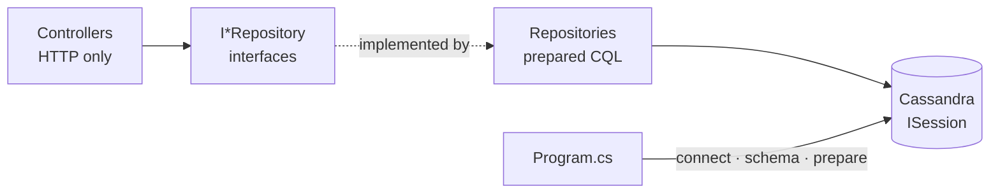
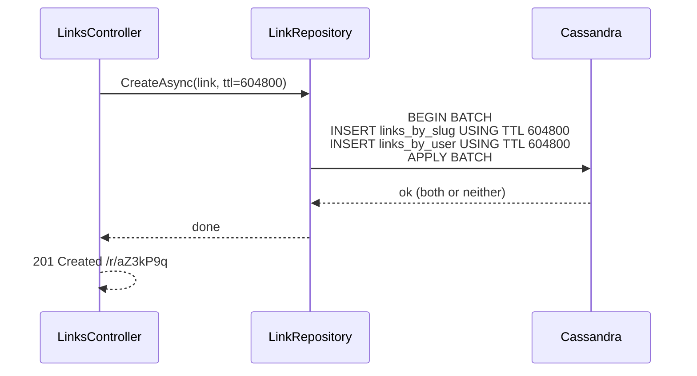

# Shortly — URL Shortener API

> 2 controllers, 6 endpoints, 3 tables: every basic CQL write (`INSERT` · `UPDATE` · `DELETE` · `BATCH` · `TTL` · counter) behind a repository.



## Layout
```text
samples/Shortly/
├── Program.cs                 # wiring only: AddCassandraAsync → controllers
├── Extensions/
│   └── Registration.cs        # connect · schema · repositories → DI
├── Controllers/
│   ├── LinksController.cs     # create · list · update · delete
│   └── ClicksController.cs    # follow (redirect) · stats
├── Models/
│   ├── Link.cs                # the row
│   ├── Requests.cs            # input + validation attributes
│   └── Responses.cs           # output
├── Repositories/
│   ├── ILinkRepository.cs  →  LinkRepository.cs   # 2 tables, always written in one batch
│   └── IClickRepository.cs →  ClickRepository.cs  # counter table
├── Infrastructure/
│   ├── CassandraSetup.cs      # cluster + schema loader
│   └── schema.cql             # keyspace + 3 tables
└── Shortly.http               # ready-to-send requests
```

## Data Model — one table per query
| Table | Partition key | Clustering | Answers |
|---|---|---|---|
| `links_by_slug` | `slug` | — | slug → url |
| `links_by_user` | `user_id` | `created_at DESC, slug` | user's links, newest first |
| `link_clicks` | `slug` | — (`counter`) | click count |

## Endpoint → CQL map
| # | Endpoint | CQL | Repository |
|---|---|---|---|
| 1 | `POST /api/links` | `BATCH { INSERT … USING TTL ? ×2 }` | `LinkRepository.CreateAsync` |
| 2 | `GET /api/links?userId=` | `SELECT … WHERE user_id = ? LIMIT ?` | `LinkRepository.GetByUserAsync` |
| 3 | `PUT /api/links/{slug}` | `BATCH { UPDATE … USING TTL ? SET url = ? ×2 }` | `LinkRepository.UpdateUrlAsync` |
| 4 | `DELETE /api/links/{slug}` | `BATCH { DELETE ×2 }` + `DELETE` counter | `LinkRepository.DeleteAsync` |
| 5 | `GET /r/{slug}` | `SELECT` + `UPDATE clicks = clicks + 1` → 302 | `ClickRepository.IncrementAsync` |
| 6 | `GET /api/links/{slug}/stats` | `SELECT clicks` + `TTL(url)` | `ClickRepository.GetAsync` |

## Create, step by step


## Run
```bash
docker compose -f docker/single/compose.yml up -d   # from cassandra-guide/
dotnet run --project samples/Shortly       # http://localhost:5080, schema created on start
```
Then open **http://localhost:5080/swagger** (Swagger UI), or send the requests in [Shortly.http](Shortly.http) in order (paste the `slug` from request 1).

```bash
curl -s -X POST localhost:5080/api/links -H "Content-Type: application/json" \
  -d '{"userId":"3f1c2b7e-9a4d-4c61-8e2f-5b0a7d9c1e44","url":"https://cassandra.apache.org","ttlDays":7}'
# {"slug":"aZ3kP9q","url":"https://cassandra.apache.org","shortUrl":"http://localhost:5080/r/aZ3kP9q",
#  "createdAt":"…","expiresInSeconds":604800}
```

## Key Points
- Same link, 2 tables → logged batch
- `TTL(url)` = seconds left
- Counter: no TTL, no batch mixing
- `+1` not idempotent → no retry
- `DELETE` = tombstone, not removal

## Pitfall — UPDATE drops TTL
❌ `UPDATE links_by_slug SET url = ? WHERE slug = ?` → `url` never expires, row outlives its TTL
✅ `UPDATE links_by_slug USING TTL ? SET url = ? WHERE slug = ?` with the seconds left from `TTL(url)`
